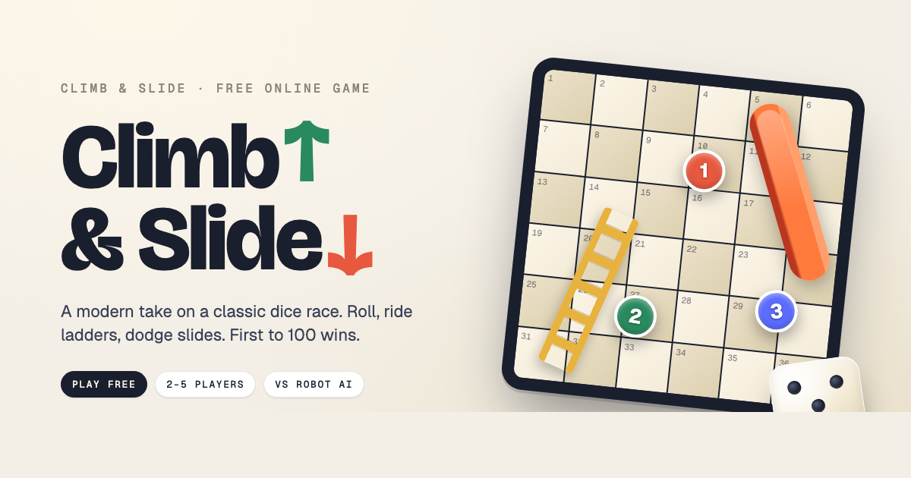

# Climb & Slide

A modern take on a classic dice race — roll, ride ladders, dodge slides, watch for portals. First to 100 wins.

**Play it: [m1k3yf.github.io/climb-and-slide](https://m1k3yf.github.io/climb-and-slide/)**



## What's inside

- 🎲 Real dice physics — tap to roll, or press-and-fling to toss it across the screen
- 🪜 Ladders, 🛝 chutes, and the occasional 🌀 portal that warps you anywhere
- 🤖 Play solo against **BLIP**, a chatty robot opponent
- 👥 Pass & play with up to 5 friends on one device
- 🎨 8 hand-drawn character tokens, customizable names
- ⚙️ Adjustable speed, win rules, and confetti density
- 🌗 Honors `prefers-reduced-motion` and is keyboard-navigable

## Tech notes

The game is a single React app loaded from `game.js` (pre-compiled from `game.jsx`).
The shell HTML files (`index.html` and `game.html`) are 118-line wrappers — just
head metadata, the root div, and the script tags. No bundler, no framework
boilerplate, no production runtime beyond React itself.

### Editing

Open `game.jsx`. All gameplay, components, and styles live there.

### Building before push

After editing, run:

```sh
npm install     # one-time
npm run build   # compiles game.jsx → game.js (Babel + @babel/preset-react)
```

Or just `bash build.sh`. The script auto-installs the Babel toolchain if missing.

### Running locally

```sh
npm run dev     # serves on localhost:8765
# or
python3 -m http.server
```

`og.html` is the design source for the 1200×630 social-share preview (`og.png`).
It's marked `noindex` so it won't compete in search results.

## Repository layout

```
.
├── index.html              # GitHub Pages entry — same app as game.html
├── game.html               # main game (React, single file)
├── og.html                 # design source for the OG share image (noindex)
├── og.png                  # 1200x630 social-share preview
├── manifest.webmanifest    # PWA manifest for add-to-home-screen
├── robots.txt
├── sitemap.xml
└── README.md
```

## Credits

Designed and built by [@m1k3yf](https://github.com/m1k3yf). If you enjoy it,
[buy me a coffee](https://ko-fi.com/mikeyalessandro) ☕.

## License

MIT — see [LICENSE](LICENSE) for details. Game design (the Chutes & Ladders concept)
is public domain.
